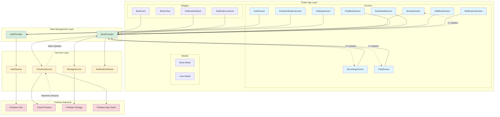

# BookSwap

A Flutter-based mobile application for book swapping, allowing users to list, browse, and swap books with other users. Built with Firebase backend services for authentication, real-time data, and cloud storage.

## Features

- **Authentication**: Email/password signup with email verification
- **Book Management**: Post, edit, and delete book listings with images
- **Search & Browse**: Search books by title/author and browse available listings
- **Real-time Chat**: Messaging system with unread message counts
- **Swap Offers**: Request, accept, and decline book swap offers
- **Notifications**: Real-time notifications for swap events with popup support
- **Dark Theme**: Modern dark UI with Google Fonts (Inter)
- **Cross-platform**: Supports Android, iOS, Web, macOS, Linux, and Windows

## Architecture

The following diagram shows the layered architecture of the BookSwap application. **Note**: This is an interactive Mermaid diagram - you can zoom and pan to explore different layers and connections.

> **[View the Architecture diagram on Mermaid Chart](https://mermaidchart.com/play?utm_source=mermaid_live_editor&utm_medium=share#pako:eNqVll1vmzAUhv8K8m6TCMw3F5WStEiTmgqNdZFGduEGk6AAjozplqX97zOBUkxwpOWC8PIcn_PaPlicwZbEGHhgR9Fxr3xfbAqF_8rqpXmwAX5WMYapMj8elUd0wnQDmphBXLilGBdln9a_uRbNK7Zv6K8Bg9FDjtLsB6Zpkm4RS0kxHqhHC0p-l3icGlFASrYg5DDOzWh1ekxLlha7cjzCiurR95hxN-MRdvQQpzdqONFyj9g4c6MnwroZSixoahRiNu4RF_GnGF39dRrvMLta_bV2mdgS0XhQbw05YYzkT-h1iHTB74LvPxnaXRtCTL26uMD0vzyveOdlV5ZXjWXlQgdVVzB6LnkvDllXq7u5auOQIYaVFSrQDue4YNe9HDSdGlDymsbCVAJ4sTQgN2ph-ppucXldI2zfhiagVyKEkZ9SXDJC8QjVo5ATbn2EiTshBsg91tVeUImVBdoe6rCeS1-LOlzb7VXzYbTMSBUrnds-1D_HtX771Ohl5YfJco-3h3Gfc02ZTu_4jrQSilJvJGylIUpTlJYobVE6onRFqalC4ea61oSgtehmLbpprkEzJGzzBM18QihKXZRGP0PYZPDbDGET47cZwsaDr4tUyODzh7Pp3ds3jLIpS_N6iyhGefnWGQnbkOZdeT7G_I_joOezxs9fP9lcv8HMG8wR-pKdMlzvepJmmfcFa4mZJAKCcqTLkSFHphxZcmTLkSNHrhzxDpOx4GM5YgPHMRIQlKLwY1SSJPo2FhCUI12ODCnyu1pObIs2fChHuhwZAgIT_lmSxsBjtMITkGPKvxa4BOd60AawPT_KN8DjtzGih_oIe-djjqj4SUj-MYySarcHXoKykqvq0oH3KeIHYd49pfwAwnRJqoIBz7SMSxLgncEf4KkzDVrQdizbcVzoWq45ASfg6Zo9c11dMxxV11Roqfb7BPy91FVnrulC07FtqLqOozr2-z-9DKl_)**



### Data Flow

1. **User Interaction** → Screen widgets capture user actions
2. **State Management** → Providers (AuthProvider, BookProvider) manage app state
3. **Business Logic** → Services handle Firebase operations and data transformations
4. **Backend** → Firebase services (Auth, Firestore, Storage) persist data
5. **Real-time Updates** → StreamBuilders listen to Firestore streams for live updates

## Project Structure

```
lib/
├── main.dart                 # App entry point, Firebase initialization
├── app.dart                  # MaterialApp, routing, theme configuration
├── firebase_options.dart     # Firebase platform configurations
│
├── models/                   # Data models
│   ├── book.dart            # Book model (title, author, condition, status)
│   └── user_model.dart       # User model
│
├── providers/                # State management (Provider pattern)
│   ├── auth_provider.dart    # Authentication state
│   └── book_provider.dart    # Book operations state
│
├── services/                 # Business logic layer
│   ├── auth_service.dart     # Firebase Auth operations
│   ├── firestore_service.dart # Firestore CRUD, chats, swaps, notifications
│   ├── storage_service.dart  # Image upload with base64 fallback
│   └── notification_service.dart # Notification management
│
├── screens/                  # UI screens
│   ├── auth_screen.dart      # Sign in/Sign up
│   ├── email_verification_screen.dart
│   ├── browse_screen.dart    # Browse books, swap offers
│   ├── post_book_screen.dart # Create book listing
│   ├── my_listings_screen.dart # User's books and swap offers
│   ├── book_detail_screen.dart # Book details, edit, swap request
│   ├── edit_book_screen.dart
│   ├── chat_screen.dart      # Chat list and messaging
│   ├── notifications_screen.dart
│   └── settings_screen.dart
│
└── widgets/                  # Reusable widgets
    ├── book_card.dart        # Book display card
    ├── bottom_nav.dart       # Bottom navigation bar
    ├── notification_button.dart
    └── notification_listener.dart # Real-time notification popups
```

## Prerequisites

- Flutter SDK (>=2.18.0 <3.0.0)
- Dart SDK
- Firebase project with:
  - Authentication enabled (Email/Password)
  - Cloud Firestore database
  - Firebase Storage
  - Firebase App Check configured
- Platform-specific requirements:
  - **Android**: Android Studio, Android SDK
  - **iOS**: Xcode (macOS only)
  - **Web**: Chrome/Edge browser

## Build Steps

### 1. Clone the Repository

```bash
git clone https://github.com/BayinganaEdwin/book_swap.git
cd book_swap
```

### 2. Install Dependencies

```bash
flutter pub get
```

### 3. Firebase Configuration

#### Android Setup

1. Download `google-services.json` from Firebase Console
2. Place it in `android/app/google-services.json`
3. Ensure `android/app/build.gradle.kts` includes:
   ```kotlin
   apply plugin: 'com.google.gms.google-services'
   ```

#### iOS Setup

1. Download `GoogleService-Info.plist` from Firebase Console
2. Place it in `ios/Runner/GoogleService-Info.plist`
3. Open `ios/Runner.xcworkspace` in Xcode
4. Ensure the file is added to the Runner target

#### Web Setup

1. Firebase configuration is handled via `firebase_options.dart`
2. Ensure Firebase Web SDK is properly initialized

#### macOS Setup

1. Download `GoogleService-Info.plist` from Firebase Console
2. Place it in `macos/Runner/GoogleService-Info.plist`

### 4. Firebase App Check Configuration

The app uses Firebase App Check for security. Configure providers:

- **Android**: `AndroidPlayIntegrityProvider()` (production) or `AndroidProvider.debug` (development)
- **iOS**: `AppleDebugProvider()` (development) or `AppleAppAttestProvider()` (production)
- **Web**: `ReCaptchaV3Provider('recaptcha-v3-site-key')`

Update `lib/main.dart` with appropriate providers for your environment.

### 5. Build for Android

```bash
# Debug build
flutter build apk --debug

# Release build
flutter build apk --release

# App bundle (for Play Store)
flutter build appbundle --release
```

**Requirements:**

- Android SDK installed
- `ANDROID_HOME` environment variable set
- Android device connected or emulator running

**Run on device/emulator:**

```bash
flutter run
```

### 6. Build for iOS

```bash
# Debug build
flutter build ios --debug

# Release build
flutter build ios --release
```

**Requirements:**

- macOS with Xcode installed
- iOS Simulator or physical device
- Valid Apple Developer account (for release builds)

**Run on simulator:**

```bash
flutter run
```

**Run on device:**

1. Open `ios/Runner.xcworkspace` in Xcode
2. Select your device
3. Click Run, or use `flutter run`

### 7. Build for Web

```bash
# Debug build
flutter build web --debug

# Release build
flutter build web --release
```

**Run locally:**

```bash
flutter run -d chrome
```

**Deploy:**

- Use Firebase Hosting:
  ```bash
  firebase deploy --only hosting
  ```
- Or deploy `build/web/` to any static hosting service

### 8. Build for macOS

```bash
# Debug build
flutter build macos --debug

# Release build
flutter build macos --release
```

**Requirements:**

- macOS with Xcode
- Valid code signing certificate (for release)

**Run:**

```bash
flutter run -d macos
```

### 9. Build for Linux

```bash
# Debug build
flutter build linux --debug

# Release build
flutter build linux --release
```

**Requirements:**

- Linux with development tools installed
- CMake, Ninja, pkg-config

**Run:**

```bash
flutter run -d linux
```

### 10. Build for Windows

```bash
# Debug build
flutter build windows --debug

# Release build
flutter build windows --release
```

**Requirements:**

- Windows with Visual Studio
- Windows SDK

**Run:**

```bash
flutter run -d windows
```

## Running the App

### Development Mode

```bash
# Run on default device
flutter run

# Run on specific device
flutter devices  # List available devices
flutter run -d <device-id>

# Run with hot reload enabled (default)
# Press 'r' in terminal to hot reload
# Press 'R' to hot restart
```

### Debugging

```bash
# Run in debug mode with verbose logging
flutter run --verbose

# Run with specific flavor (if configured)
flutter run --flavor development
```

## Dependencies

### Core Dependencies

- **flutter**: Flutter SDK
- **firebase_core**: ^4.2.1 - Firebase initialization
- **firebase_auth**: ^6.1.2 - Authentication
- **cloud_firestore**: ^6.1.0 - NoSQL database
- **firebase_storage**: ^13.0.4 - File storage
- **firebase_app_check**: ^0.4.1+2 - Security

### State Management & Utilities

- **provider**: ^6.0.5 - State management
- **image_picker**: ^1.2.0 - Image selection
- **uuid**: ^4.5.2 - Unique ID generation

### UI & Styling

- **google_fonts**: ^6.1.0 - Google Fonts integration
- **intl**: ^0.20.2 - Internationalization

## Firebase Collections Structure

### Firestore Collections

```
users/
  {userId}/
    - name: string
    - email: string

books/
  {bookId}/
    - title: string
    - author: string
    - condition: string (new, like-new, good, fair)
    - status: string (available, pending, swapped)
    - imageUrl: string
    - userId: string
    - createdAt: timestamp

swapOffers/
  {offerId}/
    - bookId: string
    - offeredBookId: string
    - fromUid: string
    - toUid: string
    - status: string (pending, accepted, declined)
    - createdAt: timestamp

chats/
  {chatId}/
    - participants: [uid1, uid2]
    - lastMessage: string
    - lastMessageTime: timestamp
    - unreadCount_uid1: number
    - unreadCount_uid2: number

messages/
  {chatId}/
    messages/
      {messageId}/
        - senderId: string
        - text: string
        - timestamp: timestamp

notifications/
  {userId}/
    notifications/
      {notificationId}/
        - type: string
        - title: string
        - message: string
        - read: boolean
        - createdAt: timestamp
```

## Environment Setup

### Android

1. Install Android Studio
2. Install Android SDK (API level 21+)
3. Set `ANDROID_HOME` environment variable:
   ```bash
   export ANDROID_HOME=$HOME/Library/Android/sdk
   export PATH=$PATH:$ANDROID_HOME/tools:$ANDROID_HOME/platform-tools
   ```

### iOS

1. Install Xcode from App Store
2. Install CocoaPods:
   ```bash
   sudo gem install cocoapods
   ```
3. Install iOS dependencies:
   ```bash
   cd ios
   pod install
   cd ..
   ```

### Web

1. Install Chrome/Edge browser
2. Enable web support in Flutter:
   ```bash
   flutter config --enable-web
   ```

## Troubleshooting

### Common Issues

1. **Firebase initialization errors**

   - Verify `google-services.json` / `GoogleService-Info.plist` are in correct locations
   - Check Firebase project configuration

2. **Image upload failures**

   - App falls back to base64 encoding automatically
   - Check Firebase Storage rules

3. **Build errors**

   - Run `flutter clean`
   - Run `flutter pub get`
   - Delete `build/` folder and rebuild

4. **iOS build issues**

   - Run `cd ios && pod install && cd ..`
   - Clean Xcode build folder (Product → Clean Build Folder)

5. **Android build issues**
   - Verify `ANDROID_HOME` is set
   - Update Android SDK tools
   - Check Gradle version compatibility

## Contributing

1. Fork the repository
2. Create a feature branch (`git checkout -b feature/amazing-feature`)
3. Commit your changes (`git commit -m 'Add amazing feature'`)
4. Push to the branch (`git push origin feature/amazing-feature`)
5. Open a Pull Request

## License

This project is licensed under the MIT License.

## Author

BayinganaEdwin - e.bayingana@alustudent.com

---

**Note**:
Ensure all Firebase services are properly configured before building. The app requires active Firebase project with Authentication, Firestore, and Storage enabled.
